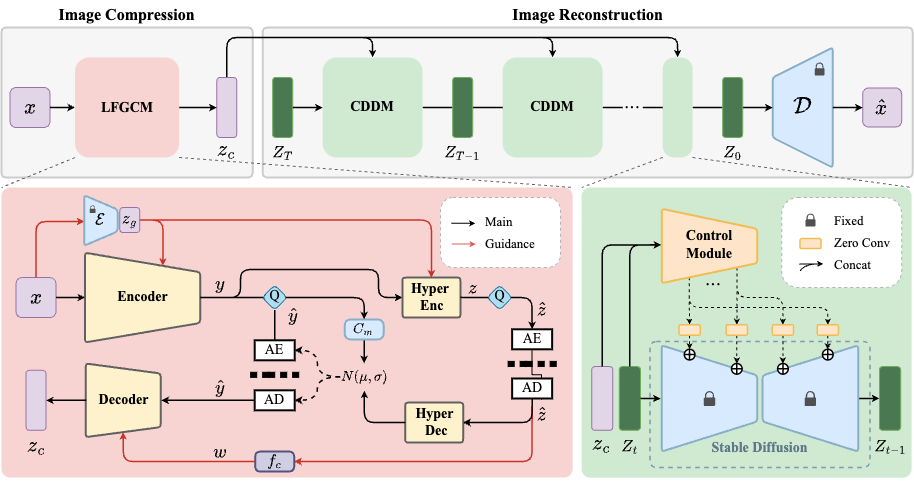
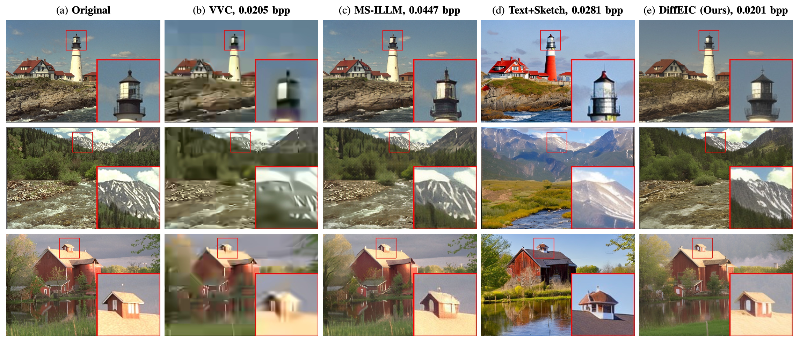
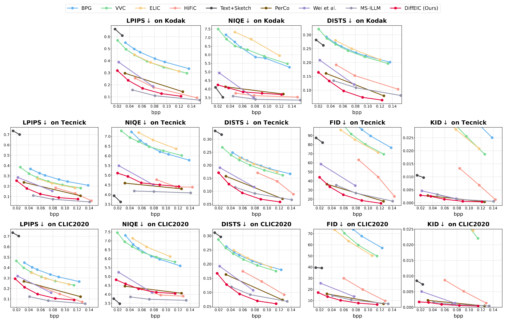

## Towards Extreme Image Compression with Latent Feature Guidance and Diffusion Prior

> [Zhiyuan Li](https://github.com/huai-chang), Yanhui Zhou, [Hao Wei](https://github.com/cshw2021), Chenyang Ge, Jingwen Jiang<br>
> :partying_face: The paper is accepted by IEEE Transactions on Circuits and Systems for Video Technology.

<p align="center">
    <br>
</p>

## :book: Table Of Contents

- [Visual Results](#visual_results)
- [Quantitative Performance](#quantitative_performance)
- [Train](#train)
- [TODO](#todo)
- [Acknowledgement](#acknowledgement)
- [Citation](#cite)

## <a name="visual_results"></a>:eyes: Visual Results
<p align="center">
    <br>
</p>

## <a name="quantitative_performance"></a>:crossed_swords: Quantitative Performance
<p align="center">
    <br>
</p>

## <a name="train"></a>:computer: Train
### Preparation
1. Generate file list of training set and validation set.

   ```
   python3 make_fire_list.py\
   --train_folder [path_to_train_folder]\
   --test_folder [path_to_test_folder]\
   --save_folder [path_to_save_floder]
   ```
   After running this script, you will get two file lists in save_folder, each line in a file list contains an absolute path of an image file:

   ```
   save_folder
   ├── train.list # training file list
   └── valid.list # validation file list
   ```

2. Download pretrained [Stable Diffusion v2.1](https://huggingface.co/stabilityai/stable-diffusion-2-1-base) into `./weight`.
   ```
   wget https://huggingface.co/stabilityai/stable-diffusion-2-1-base/resolve/main/v2-1_512-ema-pruned.ckpt --no-check-certificate
   ```

3. Modify the configuration file `./configs/train_diffeic.yaml` and `./configs/model/diffeic.yaml` accordingly.

4. Start training.
   ```
   python3 train.py
   ```

## <a name="todo"></a>:memo: TODO
- [x] Release code
- [ ] Release pretrained models

## <a name="acknowledgement">:heart: Acknowledgement
This work is based on [ControlNet](https://github.com/lllyasviel/ControlNet), [DiffBIR](https://github.com/XPixelGroup/DiffBIR), and [ELIC](https://github.com/JiangWeibeta/ELIC), thanks to their invaluable contributions.

## <a name="cite"></a>:clipboard: Citation

Please cite us if our work is useful for your research.

```
@article{li2024towards,
  title={Towards Extreme Image Compression with Latent Feature Guidance and Diffusion Prior},
  author={Li, Zhiyuan and Zhou, Yanhui and Wei, Hao and Ge, Chenyang and Jiang, Jingwen},
  journal={arXiv preprint arXiv:2404.18820},
  year={2024}
}
```